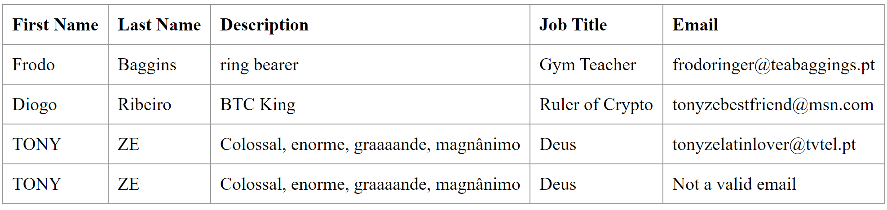

# 1. Analysis

1. Add an email field with respective validations and tests to an application.  
   1.1 The email field should accept email String formats (example: tonyze@veryswitch.pt).  
   1.2 It should not accept invalid email strings (no @, one word only,...) and null or empty strings.
2. Keep track of stable versions and create new features using Git.
3. Implement the solution recurring to another Version Control System, other than Git.

# 2. Design

Regarding the email field and respective validation and testing, a _private String email_ will be added to the Employee
Class.  
This field will be validated using a Regex (Regular expression) to guarantee that it corresponds to the requirements.  
As it is not a _built from scratch_ application, an "invalid email" message will be displayed in the _frontend_
when an invalid email is added to an Employee, instead of the complete "Try/Catch" solution.

Besides, _frontend_ will also have to display such information and the _email_ field will also be added in the app.js,
and the DatabaseLoader, in order to be displayed in the browser.

# 3. Implementation

During the workflow, several commits were made using different branches.  
The main branch (master) received only stable versions of the Application, while the feature-specific branches received
regular updates to the project (e.g. When an issue was closed, a commit was made to this branch).  
Afterwards, the stable version was merged with master and then pushed to the master remote repository.

# Workflow/Tutorial

## 1. Create a tag

Create the "v1.2.0" tag for the last commit using:

_git tag -a v1.2.0 -m "initial commit of CA1"_

## 2. Develop new features in specific branches

### 1. Create a new branch named _email-field_.

1.1 Type _git branch email-field_ in the command line.

1.2 Change to new branch using _git checkout email-field_.

1.3 Create new branch on the remote repository using _git remote --set-upstream origin email-field_

### 2. Add support to the email field

2.1 Add an attribute (_Email_) to the Employee Class and include such attribute in the Constructor.

2.2 Add Getter and Setter for that attribute.

2.3 Add a table header named _Email_ in the app.js file.

2.4 Add a table data cell in the same file, in order to obtain the atribute email from the Employee objects included in
Class _DatabaseLoader_.

2.5 Add a new Employee instance in the DatabaseLoader and add the email field to the previously existing instances.

### 3. Add validation to the email field in order to not accept null/empty/blank emails.

Extended this validation to the other attributes in the Employee Class.

As there are no business rules to follow and as previously mentioned, the validations will not throw an exception when
null/empty/blank fields are inserted, even though that would be the most detailed method.

Instead, the respective atribute will be substituted by a default message (e.g. "
Not a valid name")

Generic "wrong field" messages:

````java 
    private final String INVALIDEMAIL = "Not a valid email";
    private final String INVALIDNAME = "Not a valid name";
    private final String INVALIDDESCRIPTION = "Not a valid description";
    private final String INVALIDJOBTITLE = "Influencer is not a valid job";
````

Validation Methods:

````java    
    public void verifyEmail(String email) {
        if (validateEmail(email)) {
            this.email = email;
        } else {
            this.email = INVALIDEMAIL;
        }
    }

    public void verifyFirstName(String name) {
        if (validateName(name)) {
            this.firstName = name;
        } else {
            this.firstName = INVALIDNAME;
        }
    }

    public void verifyLastName(String name) {
        if (validateName(name)) {
            this.lastName = name;
        } else {
            this.lastName = INVALIDNAME;
        }
    }

    public void verifyDescription(String description) {
        if (validateName(description)) {
            this.lastName = description;
        } else {
            this.lastName = INVALIDDESCRIPTION;
        }
    }

    public void verifyJobTitle(String jobTitle) {
        if (validateName(jobTitle)) {
            this.lastName = jobTitle;
        } else {
            this.lastName = INVALIDJOBTITLE;
        }
    }

    private boolean validateEmail(String email) {
        boolean valid;
        if (email == null || email.isEmpty() || email.trim().length() == 0) {
            valid = false;
        } else {
            valid = true;
        }
        return valid;
    }

    private boolean validateName(String name) {
        boolean valid;
        if (name == null || name.isEmpty() || name.trim().length() == 0) {
            valid = false;
        } else {
            valid = true;
        }
        return valid;
    }

    private boolean validateDescription(String description) {
        boolean valid;
        if (description == null || description.isEmpty() || description.trim().length() == 0) {
            valid = false;
        } else {
            valid = true;
        }
        return valid;
    }

    private boolean validateJobTitle(String jobTitle) {
        boolean valid;
        if (jobTitle == null || jobTitle.isEmpty() || jobTitle.trim().length() == 0) {
            valid = false;
        } else {
            valid = true;
        }
        return valid;
    }


//Updated Employee Constructor

    public Employee(String firstName, String lastName, String description, String jobTitle, String email) {
      verifyFirstName(firstName);
      verifyLastName(lastName);
      verifyDescription(description);
      verifyJobTitle(jobTitle);
      verifyEmail(email);
    }
````

Tests:

````java
        String firstName="Tony";
        String lastName="Ze";
        String description="Enorme";
        String jobTitle="Lord";
        String email="tonyze@latinlover.pt";
        String INVALIDEMAIL="Not a valid email";
        String INVALIDNAME="Not a valid name";
        String INVALIDDESCRIPTION="Not a valid description";
        String INVALIDJOBTITLE="Influencer is not a valid job";

@Test
@DisplayName("Verify correct firstName in valid Employee instance")
    void verifyFirstNameInValidEmployee(){
            Employee newEmployee=new Employee(firstName,lastName,description,jobTitle,email);
            String expectedFirstName="Tony";
            String result=newEmployee.getFirstName();
            assertEquals(expectedFirstName,result);
            }

@Test
@DisplayName("Verify correct lastName in valid Employee instance")
    void verifyLastNameInValidEmployee(){
            Employee newEmployee=new Employee(firstName,lastName,description,jobTitle,email);
            String expectedLastName="Ze";
            String result=newEmployee.getLastName();
            assertEquals(expectedLastName,result);
            }

@Test
@DisplayName("Verify correct description in valid Employee instance")
    void verifyDescriptionInValidEmployee(){
            Employee newEmployee=new Employee(firstName,lastName,description,jobTitle,email);
            String description="Enorme";
            String result=newEmployee.getDescription();
            assertEquals(description,result);
            }

@Test
@DisplayName("Verify correct job title in valid Employee instance")
    void verifyJobTitleInValidEmployee(){
            Employee newEmployee=new Employee(firstName,lastName,description,jobTitle,email);
            String jobTitle="Lord";
            String result=newEmployee.getJobTitle();
            assertEquals(jobTitle,result);
            }

@Test
@DisplayName("Verify correct email in valid Employee instance")
    void verifyEmailInValidEmployee(){
            Employee newEmployee=new Employee(firstName,lastName,description,jobTitle,email);
            String email="tonyze@latinlover.pt";
            String result=newEmployee.getEmail();
            assertEquals(email,result);
            }

@DisplayName("Assert that null/empty/blank First Names are replaced by standard String")
@ParameterizedTest
@ValueSource(strings = {" "})
@NullAndEmptySource
    void replaceEmptyNullAndBlankFirstNameForStandardMessage(String invalidValue){
            String expected=INVALIDNAME;
            Employee tony=new Employee(invalidValue,lastName,description,jobTitle,email);
            String result=tony.getFirstName();
            assertEquals(expected,result);
            }

@DisplayName("Assert that null/empty/blank Last Names are replaced by standard String")
@ParameterizedTest
@ValueSource(strings = {" "})
@NullAndEmptySource
    void replaceEmptyNullAndBlankLastNameForStandardMessage(String invalidValue){
            String expected=INVALIDNAME;
            Employee tony=new Employee(firstName,invalidValue,description,jobTitle,email);
            String result=tony.getLastName();
            assertEquals(expected,result);
            }

@DisplayName("Assert that null/empty/blank Description are replaced by standard String")
@ParameterizedTest
@ValueSource(strings = {" "})
@NullAndEmptySource
    void replaceEmptyNullAndBlankDescriptionForStandardMessage(String invalidValue){
            String expected=INVALIDDESCRIPTION;
            Employee tony=new Employee(firstName,lastName,invalidValue,jobTitle,email);
            String result=tony.getDescription();
            assertEquals(expected,result);
            }

@DisplayName("Assert that null/empty/blank Job Title are replaced by standard String")
@ParameterizedTest
@ValueSource(strings = {" "})
@NullAndEmptySource
    void replaceEmptyNullAndBlankJobTitleForStandardMessage(String invalidValue){
            String expected=INVALIDJOBTITLE;
            Employee tony=new Employee(firstName,lastName,description,invalidValue,email);
            String result=tony.getJobTitle();
            assertEquals(expected,result);
            }

@DisplayName("Assert that null/empty/blank Job Title are replaced by standard String")
@ParameterizedTest
@ValueSource(strings = {" "})
@NullAndEmptySource
    void replaceEmptyNullAndBlankEmailForStandardMessage(String invalidValue){
            String expected=INVALIDEMAIL;
            Employee tony=new Employee(firstName,lastName,description,jobTitle,invalidValue);
            String result=tony.getEmail();
            assertEquals(expected,result);
            }

            }
````

### 4. Debbuging

4.1 Run the tests in the Employee Class.

4.2 Launch the application using _./mvnw spring-boot:run_ or run it through an IDE.

4.3 Check info status on the browser to see if the information is updated (localhost:8080).

### 5. Merge with master

5.1 Update the _email-field_ remote repository by commiting all changes.

5.2 Checkout to master branch using _git checkout master_

5.3 Merge _email-field_ with _master_ using _git merge email-field_

5.4 If needed, solve conflicts.

5.5 After successful merge, there will be no changes to commit so type _git push origin master_
to send the changes to the remote master branch.

5.6 Create tag using _git tag v1.3.0_

5.7 Update repository with previous tag using _git push origin master v1.3.0_

---

### 6. Fix invalid email

6.1 Create a new branch named _fix-invalid-email_ using _git checkout -b fix-invalid-email_

6.2 Add validation to email field String

```java
  private boolean validateEmail(String email) {
        boolean valid;
        if (email == null || email.isEmpty() || email.trim().length() == 0) {
            valid = false;
        } else {
            String emailRegex = "[A-Z0-9a-z._%-]+@[A-Za-z0-9.-]+\\.[A-Za-z]{2,6}";
            Pattern pat = Pattern.compile(emailRegex);
            valid = pat.matcher(email).matches();
        }
        return valid;
        }
```

6.3 Add tests scenarios to verify the new validation.

````java
    @DisplayName("Assert an invalid email is replaced with the error message")
    @ParameterizedTest
    @ValueSource(strings = {"tony","tony@bbc@pinterest","tony?itsme@tvtel.pt", "tony:tony@counterstrikeforever.com", "tonyverynice.underground"})
    @NullAndEmptySource
    void replaceInvalidEmailsWithStandardErrorMessage(String value) {
        String expected = INVALIDEMAIL;
        Employee employee = new Employee(firstName, lastName, description, jobTitle, value);
        String result = employee.getEmail();
        assertEquals(expected, result);
    }
````

6.4 Repeat step _4. Debbuging_ (For example add a new Employee with an invalid email to verify _invalid email_ field in the server side)



### 7 Merge with master (v1.3.1)

7.1 Update the _fix-invalid-email_ remote repository by commiting all changes.

7.2 Checkout to master branch using _git checkout master_

7.3 Merge _fix-invalid-email_ with _master_ using _git merge _fix-invalid-email_

7.4 If needed, solve conflicts.  

7.5 After successful merge, there will be no changes to commit so type _git push origin master_
to send the changes to the remote master branch.

7.6 Create tag using _git tag v1.3.1_

7.7 Update repository with previous tag using _git push origin master v1.3.1_

### 8 End the Git Assignment with tag ca1 in your repository

8.1 Finish this tutorial by creating a tag named ca1 _git tag ca1_

8.2 Push the tag to your repository _git push origin ca1_

8.3 Congratulations! You finished your tutorial with great success like the amazing Tony Zé!

--- 
---
---

# Mercurial - Performing the assignment using an alternative to Git

# 1. Analysis of the alternative

1.1 Regarding this alternative method, Mercurial behaves in a very similar way to Git. 

1.2 It is also a Distributed VCS (meaning that each developer works directly in their local repository and changes between repositories are dealed in another step)
and it uses a _merge_ concurrency model.  

1.3 It also has in the command line it's main form of usage. All the commands are preceded by _hg_ (as in Git with _git_)

#2. Design  
  
2.1 As Mercurial works in a very similar way to Git, the solution Design is not very different than the original. Specific branches will be used to solve issues and master branch to store stable versions.  

2.2 As it is a distributed version control system, the Implementation should follow the same steps.  
     
2.3 An "initial" version of the Application will be used and the same implementation will occurr with the same fields, validation and testing (The same code excerpts will be used).  
   
2.4 The different commands used to complete the Assignment will be added to the Implementation part of the alternative tutorial.  
   
2.5 Sourceforge will be used as a remote repository to this Assignment (https://sourceforge.net/p/devops-1201778-mercurial/code/ci/default/tree/)

#3. Implementation

3.1 An initial state ot the _tut-basic_ folder is going to be used. It will also be stored in Bitbucket´s repository inside CA1.

3.2 Create a remote repository and clone it to your local folder _hg clone "repository url"_. Copy the contents of the _tut-basic_ folder to this new folder. Open command line and type _hg add_,
then perform your first commit _hg commit -m "Initial commit"_. Push the changes to the remote repository _hg push_.

3.3 Create a local branch _hg branch email-field_. Set the remote repository new branch _hg push --new-branch_

3.4 Execute the changes previously done in the Git tutorial:

3.4.1 Add an email field to Employee and support in the app.js. Update the DatabaseLoader.  
3.4.2 Add validation for all fields (null, empty, blank) and test it on backend and frontend.  
3.4.3 Commit the changes

3.5 Checkout to default branch _hg checkout default_

3.6 Merge with _email-field_ using _hg merge email-field_.  
3.6.1 Create the tag v1.3.0 _hg tag v1.3.0_.  
3.6.2 Commit the changes _hg commit -m "your message"_ and then push the changes _hg push_

3.7 Create a new branch to add the last validations to the email field and tests -> _hg branch fix-invalid-email_. Set the remote repository using _hg push --new-branch_

3.8 Add the regex validation for the email and the parameterized test (See Git tutorial). Test backend and frontend.

3.9 Commit and push the changes to the _fix-invalid-email_ branch, checkout to _default_ branch, merge both and commit and push v1.3.1.

3.10 Congratulations! You´ve finished both tutorials! Have yourself a beer and never forget the great Tony Zé!


